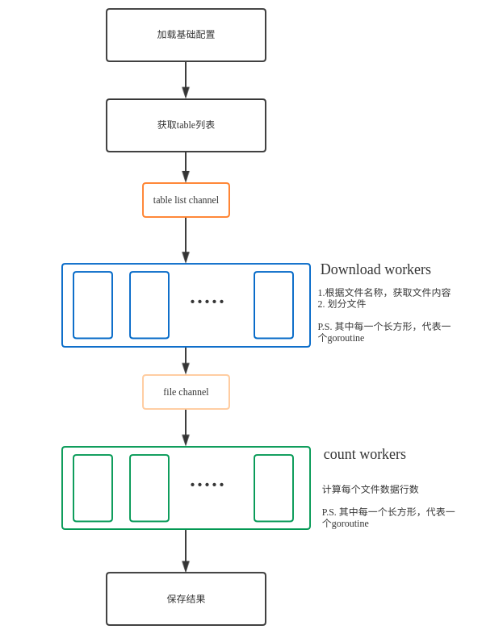
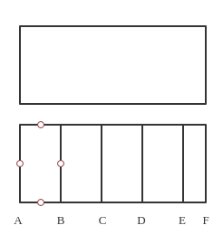
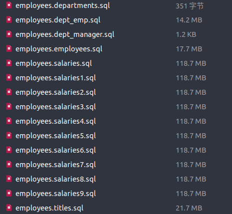

# Count Row
## overview
这个小程序主要用来统计aws s3 所有sql文件的数据行数。
  
如上图所示，程序会
1. 根据参数加载配置，启动限定数量的download worker和count worker
1. 一个goroutine获取符合的表名，并放入tableList channel中
1. download worker会去tableList channel中选取一张表，获取该表的sql文件内容。若该文件大小大于单个文件限定大小，将对文件进行拆分，拆分成后，放入table channel中
1. count worker会去table channel中选取一个文件，进行数据行统计，并写入tableState dict中

## 参数说明
> aws_access_key_id，aws_secret_access_key需先在credentials文件或环境变量中配置，sdk会自动去这两个地方查找

1. endpoint              
1. aws_region aws sdk 必填的参数，默认从环境变量中获取AWS_DEFAULT_REGION的值
1. single_file_limit 单个文件大小。若参数为10M，s3中文件为132M，则会被拆分成14个文件，每个文件大小在10M左右
1. count_worker 
1. aws_link_number aws下载连接数量 
1. bucket_name 
1. prefix aws s3 所查文件前缀
## 文件拆分方法
根据`(?m)^\(.*\)(,|;)?$`在sql文件中所匹配的数据行，每行是一条记录。若切分过程中，使其断裂，则可能统计不准。因此该方法先平分，找到几个端点，再寻找换行符，作为切分点。
但该方法也有问题，若数据记录中有换行符，则可能导致统计行数不准  
  
1. 假定文件大小为m，限定的文件长度为d，则l=m/d, 从1，2，，l依次乘以d，可以得到B,C,D,E几个点。
2. 然后分别从右往左查找换行符，则第一块就是从B向A查找，找到的点为B'，则文件最终几部分分别为(A,B'),(B',C')...(E',F),每块大小在d左右
3. 若m刚好被d整除，则E和F重合，E'可能和F重合，但并不影响
## 测试
### 测试环境
1. aws s3 新加坡节点
2. 经mydumper导出，15个sql文件，一共约1200M，数据来源[mysql](https://github.com/datacharmer/test_db)

3. 电脑：
  - cpu: AMD 1600 6核12线程
  - 内存: 8G
  - 硬盘：ssd  

### 1. 完整流程
download worker 为5，count worker为10，file limit为10M
从s3获取文件，拆分，统计数据行数，共用时442.166s，其中下载耗时较多，一个113M文件花了382s，解析耗时不到1s
因为下载速度较慢，因此cpu，内存使用率很低，没有太大并发量，无法确定参数调整。但国内aws速度应该会好很多。

### 2. count worker测试
直接从电脑读取sql文件，统计数据行数，file limit为10M
#### 1. 不拆分文件
启动15个goroutine执行，耗时21.92s，内存峰值40%，cpu峰值1100%
#### 2. 拆分文件
##### read worker=3, count worker=7
耗时20.78s，内存峰值70%，内存峰值721%
##### read worker=5, count worker=10
耗时18.27s，内存峰值80%，cpu峰值1000%
##### read worker=5, count worker=11
耗时17.82s，内存峰值87%, cpu峰值1100%

#### 小结
1. 拆分文件后，并且将读和统计分开，在使用较少的worker，速度有大幅提升
1. 在read worker数量较多情况下，read worker读取速度很快，基本不与count worker同时存在。因此可在极限情况下先测定count worker数量，再在实际运维中，确定download worker数量
1. 虽然速度提升，但内存消耗也是翻倍的。所以可以考虑使用goroutine pool，更好的管理和调整goroutine。另一个问题是对字符数据的处理。为查找换行符，使用了rune类型，必然会增加内存开销。所以如果能在不使用rune的方法查找换行符，或者确认sql文件中有ascii字符，可以直接用byte确认换行符。
1. 代码健壮性需要提升

